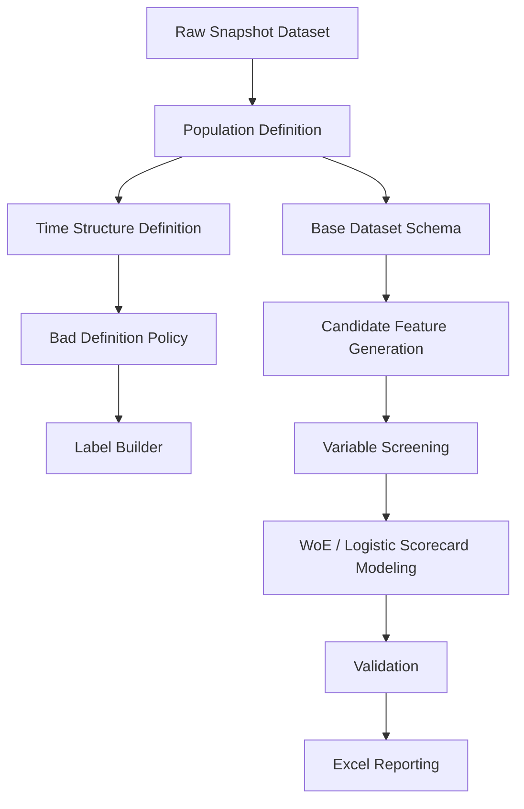
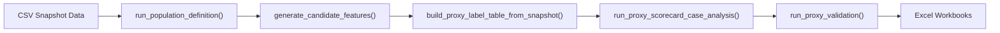
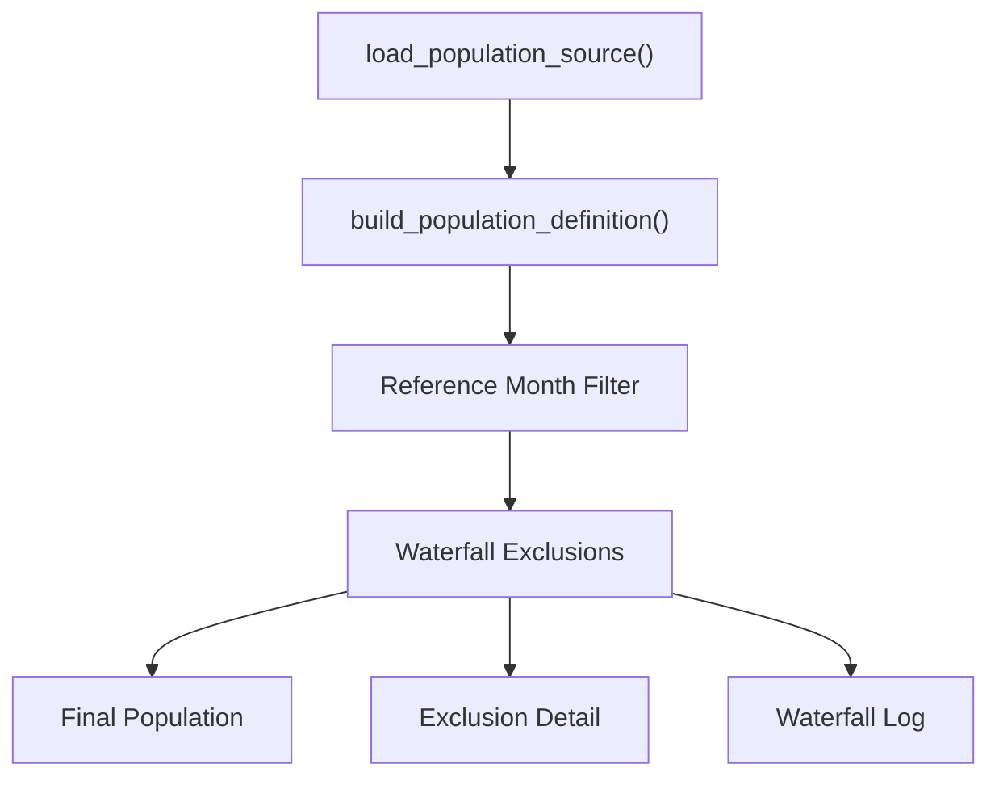
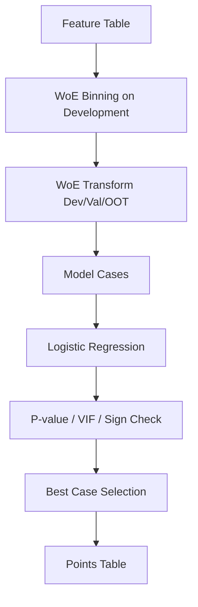
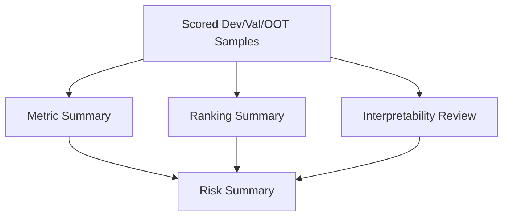

# Retail Credit Scorecard Code Wiki

## 1. Overview

This repository contains a Python-first scorecard development pipeline for a retail credit behavior scorecard template.

The implemented code follows the project framework:

1. Population Definition
2. Time Structure Definition
3. Bad Definition
4. Feature Engineering
5. Modeling
6. Validation

The current implementation supports:

- development population construction
- time structure and split definition
- bad-definition schema and proxy-label fallback
- raw-data-first base schema design
- candidate feature generation
- variable screening workflow
- provisional WoE + logistic scorecard modeling
- provisional validation reporting
- Excel reporting outputs

Important limitation:

- The current modeling and validation runs use a `proxy snapshot label`, not a true `forward 12M borrower-level bad label`.
- Therefore, current model and validation outputs are for pipeline demonstration and provisional analysis only.

## 2. Repository Map

### Core modules

| Module | Role |
|---|---|
| `src/population_definition.py` | Builds development population, exclusion detail, and waterfall log |
| `src/time_structure.py` | Defines observation windows, performance window, and split structure |
| `src/bad_definition.py` | Defines borrower-level bad-definition policy and label schema |
| `src/label_builder.py` | Defines labeling requirements and builds proxy snapshot labels |
| `src/base_dataset_schema.py` | Organizes raw schema, column groups, raw-to-feature mapping, and DQ checks |
| `src/candidate_features.py` | Generates candidate variables from raw variables only |
| `src/variable_screening.py` | Handles fine classing, IV filtering, correlation grouping, and representative selection |
| `src/scorecard_modeling.py` | Handles WoE binning, logistic regression, case analysis, scorecard points logic |
| `src/scorecard_validation.py` | Runs provisional Development / Validation / OOT validation metrics |
| `src/validation_framework.py` | Defines Traffic Light and validation metric framework |
| `src/pipeline_runner.py` | Runs the end-to-end design pipeline |
| `src/excel_report.py` | Creates high-level Excel outputs |
| `src/detailed_excel_report.py` | Creates PDF-style detailed workbook outputs |

### Alias modules

| Module | Role |
|---|---|
| `src/feature_engineering.py` | Alias export for candidate feature logic |
| `src/feature_candidates.py` | Alias export for candidate feature logic |
| `src/modeler.py` | Alias export for modeling logic |
| `src/modeling_scorecard.py` | Static model design summary tables |

## 3. End-to-End Pipeline

### High-level flow



### Current operational flow



## 4. Development Process Mapping

### 4.1 Population Definition

Implemented in:

- `src/population_definition.py`

Main outputs:

- `population_df`
- `exclusion_detail_df`
- `waterfall_log_df`

Key logic:

- key unit = `고객번호 + 기준년월`
- reference months = `2022-09`, `2023-09`, `2024-09`
- waterfall exclusions include:
  - non-retail exposure
  - inactive account
  - no valid credit card
  - non-scoring product
  - bad-at-observation-point customer

### 4.2 Time Structure Definition

Implemented in:

- `src/time_structure.py`

Current BS split logic aligned to the project PDF:

- `2022-09` = `validation_1`
- `2023-09` = `development`
- `2024-09` = `validation_2_oot`

Observation windows:

- `1M`
- `3M`
- `6M`
- `12M`

Performance window:

- `12M`

### 4.3 Bad Definition

Implemented in:

- `src/bad_definition.py`
- `src/label_builder.py`

Policy-level final bad definition:

- internal delinquency `>= 60 DPD`
- external delinquency `>= 60 DPD`
- default / charge-off / external bureau default registration

Current executable fallback:

- `build_proxy_label_table_from_snapshot()`

This fallback is only for pipeline execution when forward 12M event data is unavailable.

### 4.4 Feature Engineering

Implemented in:

- `src/candidate_features.py`

Feature families include:

- internal delinquency
- deposit performance
- salary transfer
- external bureau card usage
- external delinquency
- loan exposure
- account opening history

Pattern types include:

- recency
- frequency
- severity
- trend
- volatility

### 4.5 Variable Screening

Implemented in:

- `src/variable_screening.py`

Workflow:

1. fine classing
2. IV screening
3. correlation grouping
4. representative variable selection
5. coarse classing guidance

Current policy thresholds aligned to the PDF:

- `IV > 0.10`
- `PSI <= 0.01`
- `|correlation| < 0.70`
- `VIF < 5`

### 4.6 Modeling

Implemented in:

- `src/scorecard_modeling.py`

Modeling method:

- WoE transformation
- logistic regression
- case analysis
- scorecard points conversion

Current scaling:

- `Anchor Score = 500`
- `PDO = 40`

### 4.7 Validation

Implemented in:

- `src/scorecard_validation.py`
- `src/validation_framework.py`

Validation dimensions:

- stability validation
- discriminatory power validation
- ranking validation
- regulatory interpretability review
- model risk summary

Current metrics:

- `PSI`
- `CAR` proxy
- `KS`
- `ROC`
- `CAP` proxy
- `SDR` proxy
- `CDR` proxy
- `AR`

## 5. Code-Level Flow by Module

### Population module flow



### Modeling module flow



### Validation module flow



## 6. Important Design Decisions

### A. Why the current model is provisional

The workspace dataset contains:

- backward-looking 12M history

But it does not contain:

- forward 12M borrower-level bad events

Therefore:

- population, feature engineering, screening, and scorecard mechanics are executable
- final regulatory-grade bad labeling is not yet executable
- model fit and validation are currently based on proxy labels

### B. Why WoE coefficients appear negative

The implementation uses WoE-style transformed variables.

If raw risk direction is positive, WoE-coded coefficients can still be negative depending on:

- WoE construction convention
- bin ordering
- good/bad ratio orientation

So sign checks are performed against expected WoE direction, not raw-value direction alone.

### C. Why development period is `2023-09`

The project PDF indicates BS development should use:

- Validation1 = `2022-09`
- Development = `2023-09`
- Validation2 / OOT = `2024-09`

The codebase was updated to reflect that.

## 7. Output Files

### Summary workbook

- `reports/retail_behavior_scorecard_development_summary.xlsx`

Purpose:

- high-level process and development summary

### Provisional points table workbook

- `reports/retail_behavior_scorecard_points_table_provisional.xlsx`

Purpose:

- provisional scorecard points output using proxy label

### Detailed process workbook

- `reports/retail_behavior_scorecard_detailed_process.xlsx`

Purpose:

- PDF-style process documentation
- validation summary
- period comparison
- variable summary
- points table
- 40-point score distribution

## 8. How to Run

### Run the design pipeline

```python
from src.pipeline_runner import run_end_to_end_design

result = run_end_to_end_design()
```

### Run provisional validation

```python
from src.scorecard_validation import run_proxy_validation

validation = run_proxy_validation()
```

### Export the detailed workbook

```python
from src.detailed_excel_report import export_detailed_process_workbook

path = export_detailed_process_workbook()
print(path)
```

## 9. What Should Be Replaced Later

The following pieces should be replaced once real forward performance data is available:

1. `build_proxy_label_table_from_snapshot()`  
   Replace with a real borrower-level 12M performance label builder.

2. provisional validation metrics  
   Replace proxy `CAR`, `CAP`, `SDR`, `CDR` with formal calculation logic.

3. provisional points table  
   Rebuild scorecard points from the final validated model only.

4. provisional model case selection  
   Re-run case analysis with true development labels.

## 10. Suggested Next Technical Step

The most valuable next upgrade is:

- implement `forward_12m_label_builder.py`

This would unlock:

- real bad flag generation
- real variable screening
- real WoE classing review
- real scorecard fitting
- real validation and traffic light conclusions
